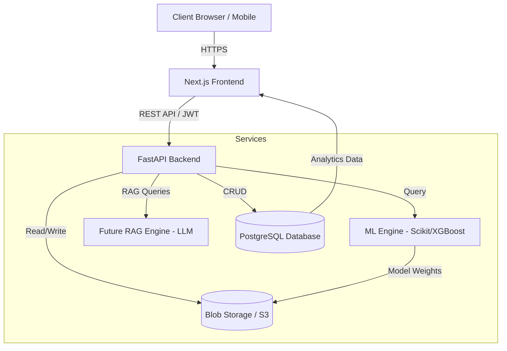
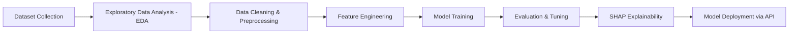
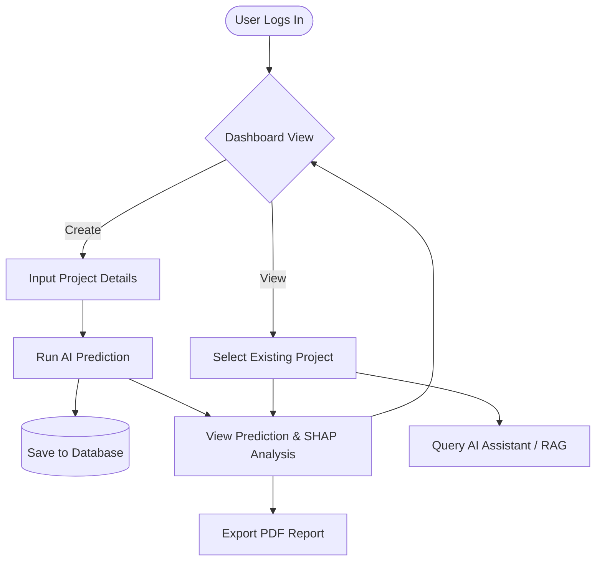

<div align="center">
  <!-- Project Logo Placeholder -->
  

  <h1>CivilSense AI</h1>
  <p><b>An Explainable AI Platform for Predicting Civil Engineering Project Success, Risk Assessment, Cost Overrun, and Schedule Delay.</b></p>

  <p>
    
    
    
    
    
    
    
    
    
  </p>
</div>

---

## 📖 Overview

### Motivation
The construction and civil engineering industry frequently struggles with massive cost overruns and unpredictable schedule delays. According to industry reports, a significant majority of large-scale construction projects exceed their original budgets and timelines, leading to substantial financial losses and strained stakeholder relationships.

### The Real-World Problem
Traditional project management methodologies rely heavily on static formulas, historical averages, and subjective human intuition. These approaches fail to account for the complex, non-linear variables inherent in modern construction—such as supply chain volatility, fluctuating labor availability, environmental factors, and macroeconomic shifts.

### Why AI is Needed
Artificial Intelligence, specifically Machine Learning, can analyze vast datasets of past projects to identify hidden patterns and correlations that human planners might miss. By leveraging predictive modeling, we can forecast potential risks, cost variations, and schedule delays before they occur, transitioning from reactive problem-solving to proactive mitigation. Furthermore, Explainable AI (XAI) ensures that these predictions are transparent and understandable, building trust among decision-makers.

### Who Benefits
- **Project Managers & Directors**: Gain data-driven insights to make informed decisions and allocate resources efficiently.
- **Stakeholders & Investors**: Receive accurate risk assessments and transparent ROI projections.
- **Contractors & Subcontractors**: Improve scheduling and minimize idle time.
- **Government & Urban Planners**: Optimize public infrastructure spending and ensure timely delivery.

---

## ✨ Features

- 🎯 **AI Project Success Prediction**: Predict the overall likelihood of project success based on initial parameters.
- ⚠️ **Risk Assessment**: Categorize and quantify various risk factors (financial, operational, environmental).
- 💰 **Cost Overrun Prediction**: Forecast the potential financial deviation from the baseline budget.
- ⏱️ **Delay Prediction**: Estimate the probability and duration of schedule extensions.
- 🧠 **SHAP Explainability**: Transparent insights into *why* the AI made a specific prediction, identifying key driving factors.
- 📊 **Interactive Dashboard**: A comprehensive, real-time visual interface for project monitoring.
- 📄 **Document Upload**: Seamless ingestion of project plans, budgets, and schedules for automated analysis.
- 🤖 **AI Assistant**: A conversational interface to query project data, ask for insights, and get recommendations.
- 📈 **Analytics**: Deep-dive statistical analysis of portfolio-wide performance.
- 📑 **Reports**: Automated generation of detailed, exportable PDF/Excel reports.
- 🔒 **Authentication**: Secure user login and identity management.
- 👥 **Role-Based Access**: Granular permissions for Admins, Managers, and Viewers.
- 📱 **Responsive UI**: Optimized experience across desktops, tablets, and mobile devices.

---

## 🏗️ Architecture



- **Frontend**: Next.js (React) application for a responsive, fast, and interactive user interface.
- **Backend**: FastAPI (Python) for high-performance, asynchronous API endpoints.
- **ML Engine**: Python-based machine learning pipeline utilizing Scikit-Learn, XGBoost, and SHAP for predictions and explainability.
- **Database**: PostgreSQL for robust relational data storage (users, projects, logs).
- **Storage**: AWS S3 or compatible blob storage for uploaded documents and saved model weights.
- **Future RAG Engine**: Retrieval-Augmented Generation system integrating LLMs with project documentation for intelligent Q&A.

---

## 💻 Tech Stack

| Category | Technologies |
| :--- | :--- |
| **Frontend** | Next.js, React, Tailwind CSS, TypeScript, Framer Motion |
| **Backend** | FastAPI, Python 3.11, Pydantic, SQLAlchemy |
| **Machine Learning** | Scikit-Learn, XGBoost, Pandas, NumPy, SHAP |
| **Database** | PostgreSQL, Redis (Caching) |
| **Authentication** | JWT, OAuth2 |
| **Visualization** | Recharts, Chart.js, Mermaid |
| **Deployment** | Docker, Nginx, Gunicorn/Uvicorn |
| **DevOps** | GitHub Actions, Terraform (Optional) |

---

## 📂 Folder Structure

```text
CivilSense-AI/
├── frontend/               # Next.js web application
│   ├── app/                # App router (pages, layouts)
│   ├── components/         # Reusable React components (UI, Charts)
│   ├── lib/                # Utility functions, API clients
│   └── public/             # Static assets (images, icons)
├── backend/                # FastAPI server
│   ├── api/                # API routes and controllers
│   ├── core/               # Configuration, security, dependencies
│   ├── models/             # Database ORM models
│   ├── schemas/            # Pydantic validation schemas
│   └── services/           # Business logic and ML integration
├── ml_engine/              # Machine Learning pipeline
│   ├── data/               # Raw and processed datasets
│   ├── notebooks/          # Jupyter notebooks for EDA and training
│   ├── src/                # Training scripts, feature engineering
│   └── saved_models/       # Serialized models (.pkl, .joblib)
├── docker/                 # Dockerfiles and Compose configurations
├── docs/                   # Additional project documentation
└── tests/                  # Unit and integration tests
```

---

## 🖥️ Screens

- **Dashboard**: The main hub displaying key metrics, recent predictions, and active projects.
- **Prediction**: Interface to input new project parameters and receive AI-generated forecasts (Cost, Time, Risk).
- **Analytics**: Comprehensive charts and graphs visualizing historical data and trends.
- **Projects**: A list view of all managed projects with filtering and sorting capabilities.
- **AI Assistant**: A chat interface interacting with the backend LLM/RAG system.
- **Reports**: Generate, view, and download detailed PDF reports for specific projects.
- **Settings**: User profile management, application preferences, and API key configuration.

---

## 🚀 Installation

### Prerequisites
- Node.js (v18+)
- Python (v3.10+)
- PostgreSQL
- Git

### Clone
```bash
git clone https://github.com/yourusername/CivilSense-AI.git
cd CivilSense-AI
```

### Install & Run (Local Development)

#### Backend (FastAPI)
```bash
cd backend
python -m venv venv
source venv/bin/activate  # On Windows: venv\Scripts\activate
pip install -r requirements.txt
uvicorn main:app --reload --port 8000
```

#### Frontend (Next.js)
```bash
cd frontend
npm install
npm run dev
```

### Environment Variables
Create a `.env` file in both `frontend` and `backend` directories based on the provided `.env.example` files. Ensure database URLs and secret keys are securely configured.

---

## 🐳 Docker

For a streamlined setup, you can run the entire stack using Docker.

### Docker Compose (Development)
```bash
docker-compose up --build
```

### Production Build
```bash
docker-compose -f docker-compose.prod.yml up -d --build
```

---

## 🗺️ Roadmap

- **Phase 1: Foundation & Frontend** - Set up repository, define architecture, build Next.js UI components and dashboard layout.
- **Phase 2: Backend & Database** - Develop FastAPI endpoints, configure PostgreSQL, implement JWT authentication and CRUD operations.
- **Phase 3: Machine Learning Integration** - Train baseline predictive models, implement SHAP explainability, and integrate models into the backend via API.
- **Phase 4: Advanced Features (RAG)** - Introduce Document Upload and RAG-based AI Assistant for intelligent querying of project files.
- **Phase 5: Cloud Deployment & CI/CD** - Containerize application, setup GitHub Actions pipelines, and deploy to cloud providers (AWS/Azure).

---

## 🧠 Machine Learning Pipeline



- **Dataset**: Curated historical data of civil engineering projects.
- **EDA**: Analyzing distributions, correlations, and missing values.
- **Cleaning**: Handling outliers, imputing missing data, encoding categorical variables.
- **Feature Engineering**: Creating derived metrics relevant to project performance.
- **Training**: Utilizing algorithms like Random Forest and XGBoost.
- **Evaluation**: Measuring MAE, RMSE, and R² scores.
- **SHAP**: Generating local and global explanations for model interpretability.
- **Deployment**: Saving trained models for inference within the FastAPI backend.

---

## 🔄 Project Workflow



---

## 🔌 API Overview

- **Authentication**: `/api/v1/auth/login`, `/api/v1/auth/register`, `/api/v1/auth/me`
- **Projects**: `/api/v1/projects` (GET, POST, PUT, DELETE)
- **Prediction**: `/api/v1/predict/cost`, `/api/v1/predict/delay`, `/api/v1/predict/risk`
- **Analytics**: `/api/v1/analytics/summary`, `/api/v1/analytics/trends`
- **Reports**: `/api/v1/reports/generate`

---

## 🔮 Future Scope

- **BIM Integration**: Direct integration with Building Information Modeling (BIM) software (e.g., Revit, AutoCAD) for 3D data extraction.
- **Drone Image Analysis**: Computer vision for analyzing site progress via drone footage.
- **Satellite Monitoring**: Tracking macro-environmental changes and site conditions from space.
- **IoT Sensors**: Real-time telemetry from construction equipment and site sensors.
- **Digital Twin**: Creating dynamic digital replicas of physical project sites.
- **LLM Assistant**: Advanced conversational agents for complex project management tasks.
- **Predictive Maintenance**: Forecasting equipment failures before they impact the schedule.

---

## 🧪 Testing

Ensure code quality and reliability through automated testing.

- **Frontend**: Jest & React Testing Library (`npm run test`)
- **Backend**: Pytest (`pytest tests/`)
- **ML**: Unit tests for data preprocessing pipelines and model inference logic.

---

## ☁️ Deployment

CivilSense AI is designed for flexible deployment across various platforms:

- **Docker**: Containerized services for environment consistency.
- **GitHub Actions**: Automated CI/CD pipelines for testing and deployment.
- **Azure / AWS**: Scalable deployment using managed services (App Service, ECS, RDS).
- **Render / Railway**: PaaS options for rapid deployment and prototyping.

---

## 🤝 Contributing

We welcome contributions from the community!

### Branch Strategy
- `main`: Production-ready code.
- `develop`: Active development branch.
- `feature/*`: New features (e.g., `feature/add-shap-integration`).
- `bugfix/*`: Bug fixes.

### Commit Convention
Follow [Conventional Commits](https://www.conventionalcommits.org/):
- `feat:` A new feature
- `fix:` A bug fix
- `docs:` Documentation only changes
- `refactor:` A code change that neither fixes a bug nor adds a feature

### Pull Requests
1. Fork the repository.
2. Create a feature branch.
3. Commit your changes.
4. Push to the branch.
5. Open a Pull Request against the `develop` branch.

---

## 📄 License

This project is licensed under the [MIT License](LICENSE) - see the LICENSE file for details.

---

## 👥 Authors

- **Project Owner** - [Your Name/Organization]
- **Contributors** - Open Source Community

---

## 🙏 Acknowledgements

- **Research Papers**: Academic studies on AI in construction management.
- **Open Source Libraries**: Scikit-Learn, FastAPI, Next.js, and the brilliant communities behind them.
- **Machine Learning Frameworks**: Tools that made this predictive engine possible.
- **Construction Management Research**: Domain expertise that shaped the feature set.
